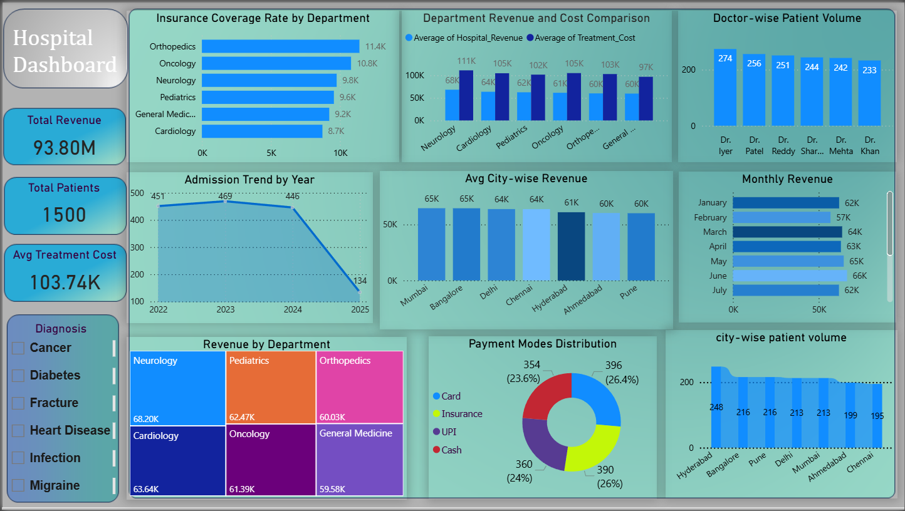

# 🏥 Hospital Operations & Revenue Analytics Dashboard (Power BI)

## 📌 Project Overview
This project analyzes hospital operational and financial performance using a real-world healthcare dataset.  
Built an interactive Power BI dashboard to track **revenue, patient flow, department efficiency, doctor workload, city performance, and payment behavior**.

---

## 📊 Dataset Scale & KPIs

- **Total Records:** 1,500 patient transactions  
- **Unique Patients:** 1,500  
- **Departments:** 6  
- **Doctors:** 6  
- **Cities Covered:** 7  
- **Date Range:** Jan 2022 – Apr 2025  
- **Total Hospital Revenue:** 93,796,615 (~93.8M)  
- **Average Treatment Cost:** 103,736 per patient  

---

## 🔍 Key Business Insights

### 🏥 Department Analysis
- Neurology and Cardiology generate the highest revenue.
- Orthopedics has the highest insurance coverage penetration.
- Oncology shows high treatment cost relative to revenue, indicating margin pressure.

### 👨‍⚕️ Doctor Performance
- Patient load is distributed across 6 doctors, with workload concentration on top performers.
- Enables staffing optimization decisions.

### 📈 Time-Based Trends
- Admissions peaked in 2023 with decline in 2025 (partial data).
- Monthly revenue shows seasonal patterns, with mid-year peaks.

### 🌍 City-Level Performance
- Bangalore and Mumbai generate the highest revenue.
- Hyderabad has the highest patient volume, indicating operational load concentration.

### 💳 Payment Mode Trends
- Insurance and Card payments dominate.
- Cash usage is declining, indicating digital adoption in healthcare payments.

---

## 💡 Business Recommendations
- Expand insurance partnerships in low-coverage departments.
- Optimize oncology pricing due to high cost-to-revenue ratio.
- Allocate additional staff to high-volume cities and doctors.
- Focus marketing in top revenue cities (Bangalore, Mumbai).
- Promote digital payment adoption to reduce cash handling costs.

---

## 🛠 Tools & Technologies
- Power BI (Dashboarding, DAX, Data Modeling)
- Excel (Data Cleaning & Preprocessing)
- SQL (optional for transformations)
- Data Visualization (KPIs, Bar Charts, Line Charts, Treemaps, Donut Charts)

---

## 📷 Dashboard Preview
(Add your screenshot here)

```bash

